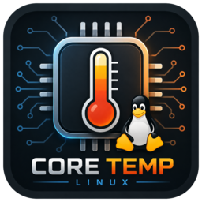

<p align="center">
  
</p>

<h1 align="center">CoreTempLinux</h1>

> Monitor de temperatura, frecuencia y carga de CPU para Linux — el equivalente
> libre de la utilidad **Core Temp** de Windows.

CoreTempLinux es una aplicación de escritorio **GTK4** escrita en **C# / .NET 10**
que muestra en tiempo real la temperatura del procesador, la frecuencia y carga
por núcleo, y otros sensores `hwmon` del sistema (voltajes, ventiladores,
potencia). Incluye una **alerta de temperatura configurable** con banner visual,
notificación de escritorio y aviso sonoro en bucle.


## Características

- 🌡️ Temperatura de CPU en vivo con mínimo/máximo de la sesión.
- ⚙️ Frecuencia y carga por núcleo (`/proc/stat` + `cpufreq`).
- 📊 Sensores adicionales del sistema: voltajes, ventiladores, potencia.
- 🔔 Alerta configurable por umbral: banner + notificación + sonido en bucle.
- 🔇 Botón de silencio por episodio de alerta.
- 🐧 Solo Linux: lee directamente de `/sys/class/hwmon` y `/proc`.

## Requisitos

- **Linux** (x64). La app depende de `/sys` y `/proc`, no funciona en otros SO.
- **[.NET 10 SDK / Runtime](https://dotnet.microsoft.com/download)** — el proyecto
  se compila `framework-dependent` y `SelfContained=false`, así que necesitas el
  runtime de .NET 10 instalado.
- **GTK 4** instalado en el sistema (`libgtk-4-1` o equivalente de tu distro).
- Opcional, para el sonido de alerta: `paplay`, `pw-play` o `ffplay`.

### Instalar dependencias por distribución

```bash
# Debian / Ubuntu
sudo apt install libgtk-4-1

# Fedora
sudo dnf install gtk4

# Arch
sudo pacman -S gtk4
```

## Compilar y ejecutar

```bash
git clone https://github.com/oswaldox199/CoreTempLinux.git
cd CoreTempLinux

dotnet build      # compila (net10.0, linux-x64)
dotnet run        # compila y abre la ventana GTK
```

Para una versión de publicación:

```bash
dotnet publish -c Release
```

## Instalación (integración con el escritorio)

Para instalar la app con su icono en el menú de aplicaciones y en la barra de
tareas, usa el script incluido:

```bash
./install.sh                 # instala para tu usuario en ~/.local
sudo PREFIX=/usr ./install.sh   # o para todo el sistema
```

El script publica la app, instala los iconos en el tema `hicolor` y coloca el
lanzador `org.coretemplinux.App.desktop`. Para desinstalar:

```bash
./uninstall.sh
```

> El icono de la barra de tareas se resuelve a partir del ID de la aplicación
> (`org.coretemplinux.App`), que coincide con el nombre del archivo `.desktop` y
> del icono instalado.

## Arquitectura

Los datos fluyen en una sola dirección sobre un temporizador GLib de 1 segundo:

```
lectores de sensores → SensorMonitor → Snapshot → MainWindow
```

- **`Sensors/HwmonReader`** — capa genérica. Recorre `/sys/class/hwmon/*` y lee
  las entradas `temp*_input`, `power*_input`, `fan*_input`, `freq*_input`,
  `in*_input`. Todo acceso a disco va envuelto en `try/catch`: los sensores son
  opcionales y varían según el hardware.
- **`Sensors/SensorMonitor`** — orquestador y única fuente de verdad para la UI.
  Elige la temperatura principal de CPU (prefiere una etiqueta `Tctl`/`Tdie`/
  `Package` de los chips `k10temp`/`coretemp`/`zenpower`; si no, el núcleo más
  caliente) y mantiene el mínimo/máximo de la sesión.
- **`Sensors/CpuFrequency`** — frecuencia por núcleo desde `cpufreq`.
- **`Sensors/CpuLoad`** — carga por núcleo a partir de dos muestras de
  `/proc/stat` (la primera llamada devuelve ceros porque no hay muestra previa).
- **`Sensors/CpuInfo`** — modelo y número de núcleos desde `/proc/cpuinfo`.
- **`Ui/MainWindow`** — construye los widgets una vez y solo actualiza sus
  valores en `Refresh()`.
- **`Ui/AudioAlert`** — reproduce un archivo de sonido freedesktop sin solaparse,
  de modo que llamarlo cada segundo produce un tono continuo.

> El texto de la interfaz y los comentarios del código están en español; se
> mantiene esa convención al contribuir.

## Contribuir

¡Las contribuciones son bienvenidas! Lee [CONTRIBUTING.md](CONTRIBUTING.md) antes
de abrir un issue o pull request.

## Licencia

Distribuido bajo la licencia **GNU General Public License v3.0**. Consulta el
archivo [LICENSE](LICENSE) para el texto completo.
